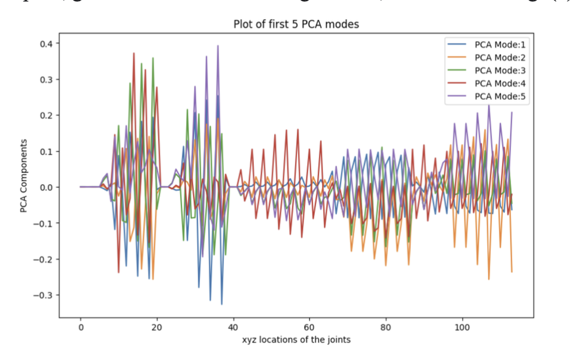
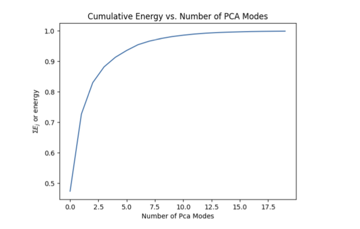
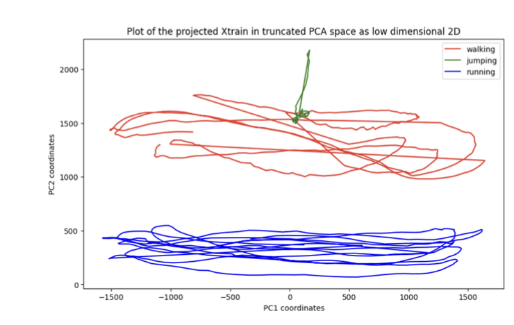
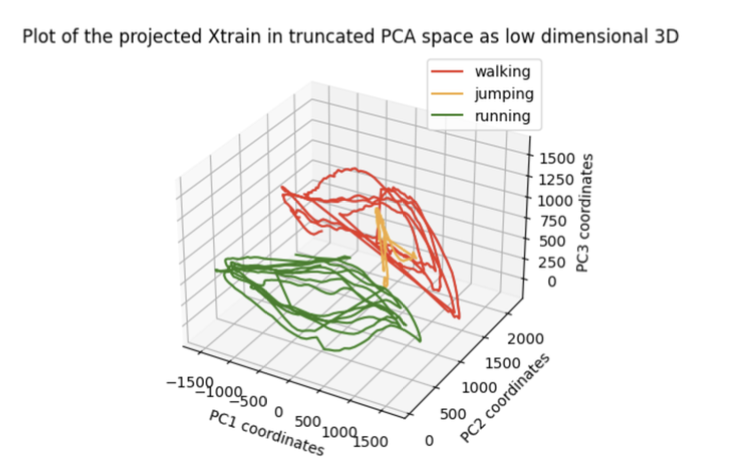
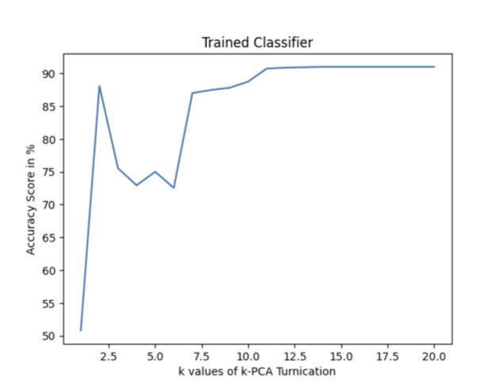
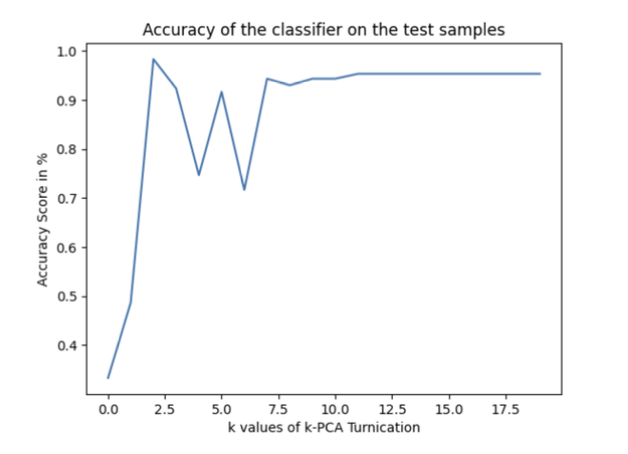

# AMATH 582 – Homework 2: Humanoid Robot Movement Classification with PCA

**Author:** Kutay Demiralay  
**Department of Aeronautics and Astronautics, University of Washington, Seattle, WA**

## Overview

In this project, I developed a classifier to distinguish between three humanoid robot motions: **jumping**, **running**, and **walking**. Using **Principal Component Analysis (PCA)** and **Singular Value Decomposition (SVD)**, I reduced the dimensionality of motion capture data and analyzed the classification accuracy as a function of the number of PCA modes used.

The classifier was trained on 15 datasets (5 for each movement type) and tested on 3 unseen datasets. The dimensionality reduction and classification steps were evaluated and visualized through cumulative energy plots, low-dimensional projections, and accuracy graphs.

## Theoretical Background

PCA is used to identify dominant modes of variation in the data by decomposing it into orthogonal components via SVD. After mean-centering the training data, SVD provides the principal components (columns of matrix U). By projecting the data onto the first k components, we obtain a truncated PCA space suitable for classification.

Classification is performed by calculating the Euclidean distance between a test point in k-PCA space and class centroids, then assigning the class label based on the closest centroid.

## Algorithm Steps

### Step 1: Compile Training and Test Matrices

- Concatenate 15 training sets into a 114×1500 `X_train` matrix
- Concatenate 3 test sets into a 114×300 `X_test` matrix

### Step 2: Perform SVD on Centered Training Data

- Mean-center `X_train`
- Apply `np.linalg.svd` to obtain U, Σ, Vᵗ

### Step 3: Visualize First 5 PCA Modes

- Plot first 5 principal components in xyz space from matrix U

### Step 4: Plot Cumulative Energy

- Compute energy via singular values
- Plot cumulative energy vs. number of PCA modes

### Step 5: Project Training Data into Truncated PCA Space

- Project onto 2D and 3D PCA spaces
- Visualize projections per movement type

### Step 6: Train and Evaluate Classifier

- Use centroids in k-PCA space for each class
- Assign class by minimum distance
- Evaluate accuracy over k = 1 to 20 PCA modes

### Step 7: Test Classifier

- Project test data using training U matrix
- Center test data using training mean
- Repeat classification and accuracy evaluation

## Figures

**Figure 1:** First 5 PCA modes in xyz space  

**Figure 2:** Cumulative Energy vs. Number of PCA Modes  

**Figure 3:** Projected Training Data in 2D PCA Space  

**Figure 4:** Projected Training Data in 3D PCA Space  

**Figure 5:** Accuracy vs. PCA Modes (Training)  

**Figure 6:** Accuracy vs. PCA Modes (Testing)  

## Results and Discussion

- Only **6 PCA modes** capture 95% of energy in Frobenius norm.
- Projections in both 2D and 3D PCA space show clear separation between motion types.
- Classifier accuracy reaches:
  - **~91%** on training data after 14 PCA modes
  - **~95%** on test data after 12 PCA modes
- Classifier is robust, with no overfitting, and performs reliably with moderate dimensionality.

## Summary and Conclusion

A classifier was successfully developed to distinguish between humanoid movements using PCA. By projecting high-dimensional motion data into a lower-dimensional space and applying a distance-based classifier, I achieved high classification accuracy. The PCA-based approach is both efficient and interpretable, with performance improving as the number of retained modes increases.

Future improvements could involve using more diverse training data or alternative classification methods (e.g., SVM, KNN) to enhance robustness across broader scenarios.

## Full Report

The full PDF report is available in the repository: [report.pdf](./report.pdf)

## Acknowledgements

Thanks to Po, Shavey, and Emoji for valuable discussions, and to Professor Eli for lectures, office hours, and code support.

## References

[1] Eli Shlizerman (2024). *582 KutzBook*. AMATH 582 Wi 24: Computational Methods for Data Analysis.
